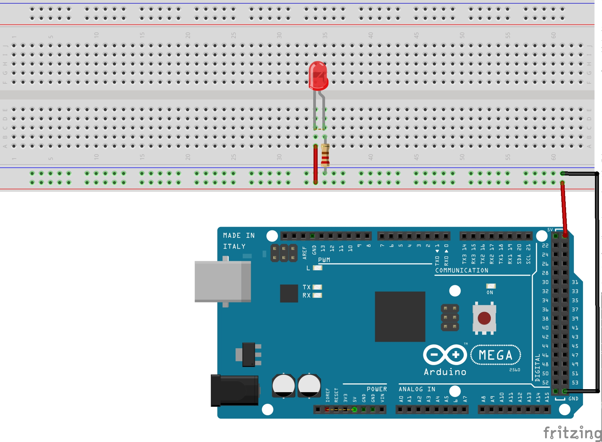

## Probador de LED con Arduino
Por medio de esta primera práctica con Arduino, evidenciamos el funcionamiento de la placa arduino y de algunos de sus pines de voltaje y de tierra, pasando energia a un protoboard con fin de encender un LED.
Se utilizo una resistencia de 220 ohmios,un LED, cable JUMPER, protoboard y la placa arduino mega.
Acontinuacion se ve el diagrama esquematicop y pictorico del circuito.
### Pictórico

### Esquemático
![alt text] (Untitled Sketch_esquemático.jpg)
