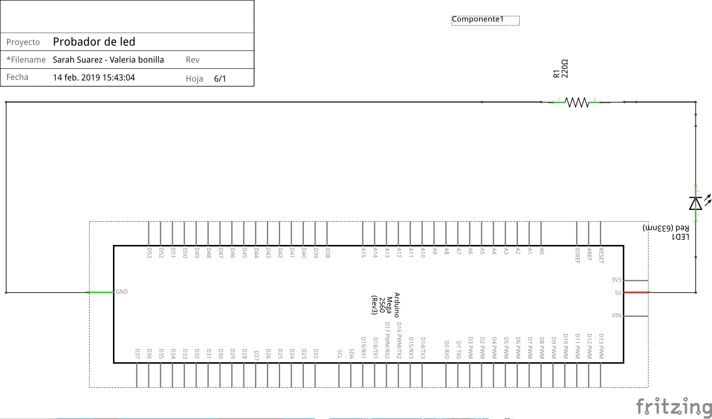

## Probador de LED con Arduino
Por medio de esta primera práctica con Arduino, evidenciamos el funcionamiento de la placa arduino y de algunos de sus pines de voltaje y de tierra, pasando energía a un protoboard con fin de encender un LED.
Se utilizó una resistencia de 220 ohmios,un LED, cable JUMPER, protoboard y la placa arduino mega.
Acontinuación se ve el diagrama esquematico y pictórico del circuito.
### Diagrama Pictórico
        
### Diagrama Esquemático

